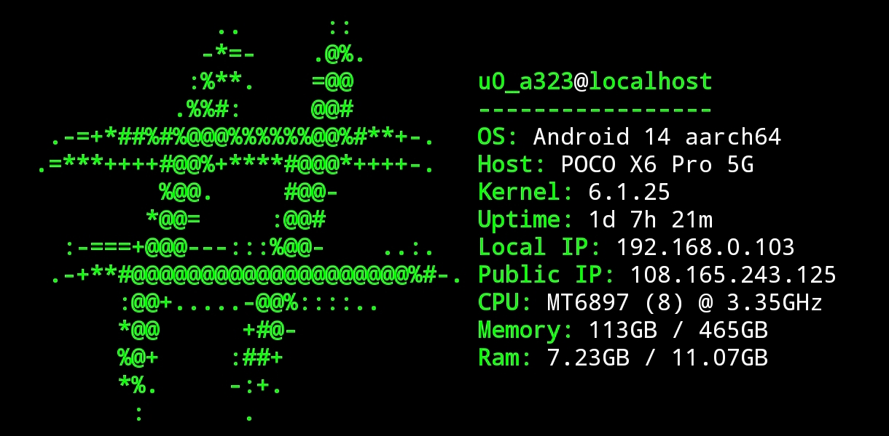

# Termux Banner

Termux banner displays system information.




## Features
- Username, host, OS, kernel
- Uptime, IP addresses
- Memory, RAM, CPU

## Installation

   ```bash
   curl -fsSL http://raw.githubusercontent.com/HashShin/Termux-Banner/main/setup.sh | bash
   ```